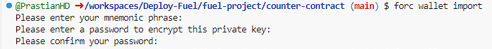
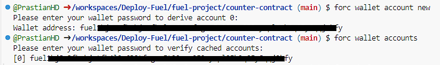
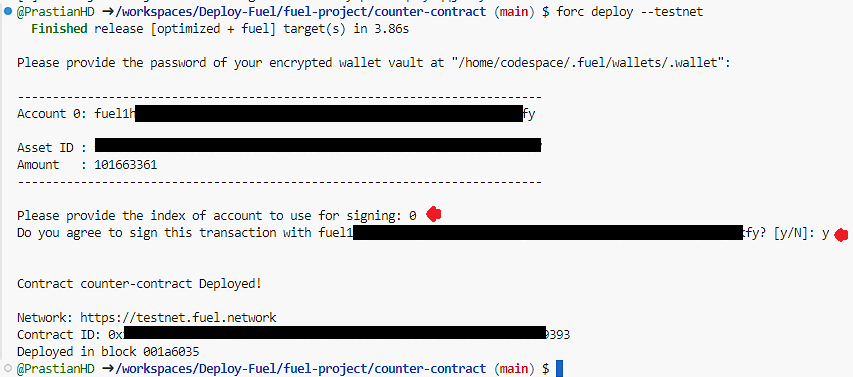

# Deploying a Contract on Fuel Sepolia Testnet

⚠︎ Use CODESPACE

## Preparation Wallet
- Download Fuel [Wallet](https://chromewebstore.google.com/detail/fuel-wallet/dldjpboieedgcmpkchcjcbijingjcgok)
- Claim [Faucet](https://faucet-testnet.fuel.network/) or [Bridge](https://app.fuel.network/bridge?from=eth&to=fuel) from ETH Sepolia

## Preparation Codespace
- Create a new [reposity](https://github.com/new) | repo name = fuel
- Create a new [codespace](https://github.com/codespaces/new) 
- Select Reposity : `yourgithub/fuel`
- others skip

## Easy Setup

```bash
sudo apt-get update -y && sudo apt-get install git build-essential -y && git clone https://github.com/PrastianHD/Deploy-Fuel.git && cd Deploy-Fuel && chmod ug+x *.sh && ./setup.sh
```
⚠︎ Would you like fuelup-init to modify your PATH variable for you? (N/y) Type `y`

## Go to counter-contract
```
cd fuel-project/counter-contract
```
```
export PATH="${HOME}/.fuelup/bin:${PATH}"
```

## Import Wallet
```bash
forc wallet import
```


⚠︎ How to Paste in Codespace is `CTRL + SHIFT + V`

⚠︎ Enter mnemonic, invisible just enter after paste

⚠︎ Enter Password

## Create Account
```bash
forc wallet account new
```


## Check Adress
```
forc wallet accounts
```

## Deploy Contract
```bash
forc deploy --testnet
```


⚠︎ Make sure you have ETH Fuel Sepolia Testnet

⚠︎ Index = 0

⚠︎ Type `y` and `ENTER`

## CONTRACT DEPLOYED

Check In [Explorer](https://app.fuel.network/)
